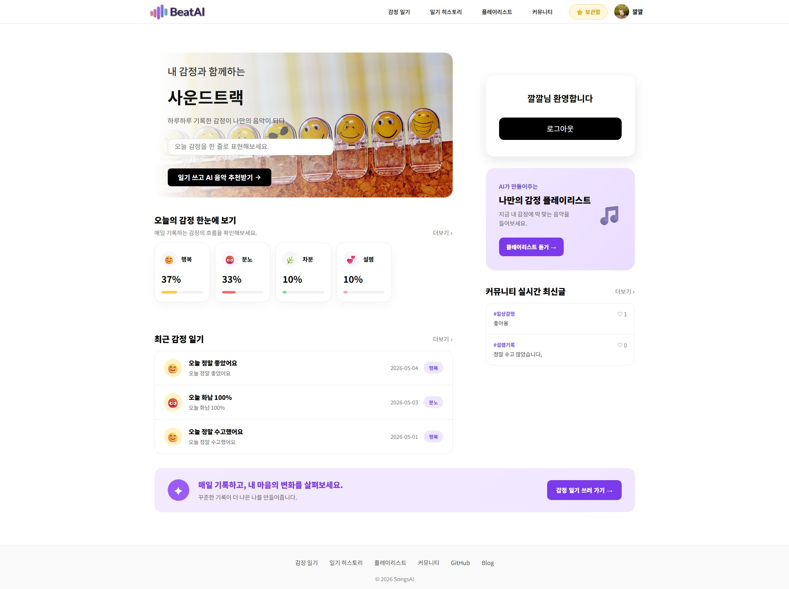
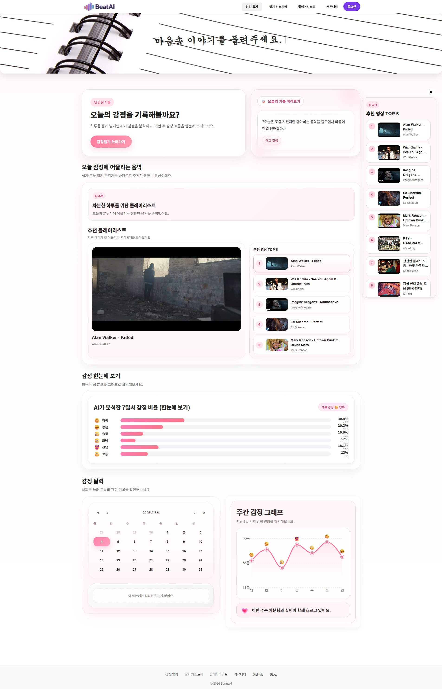
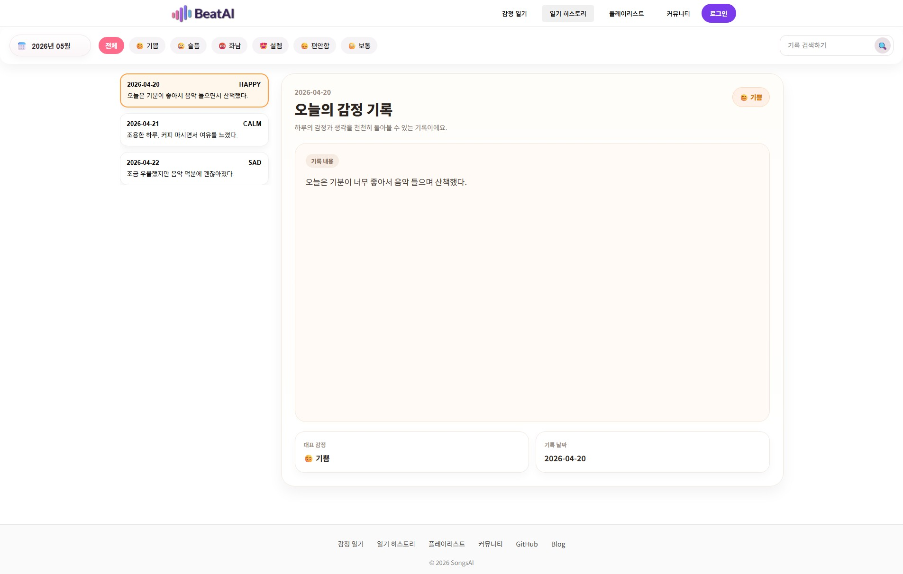
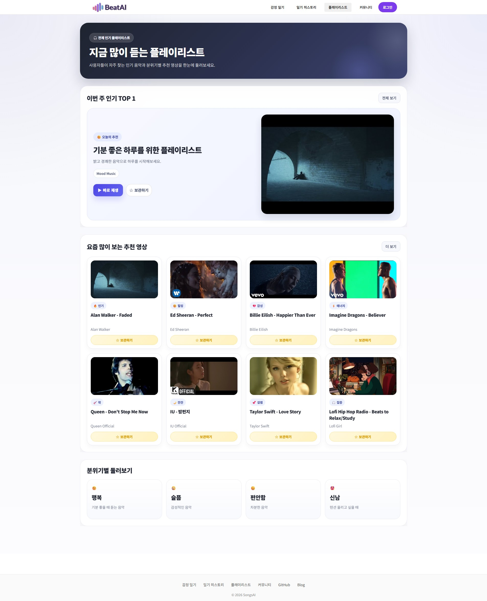
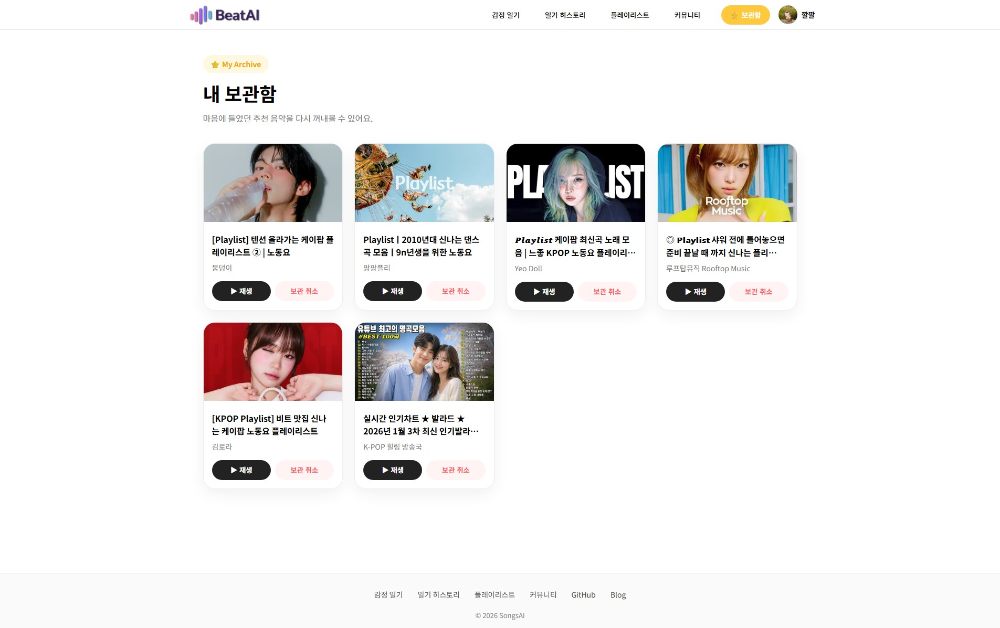
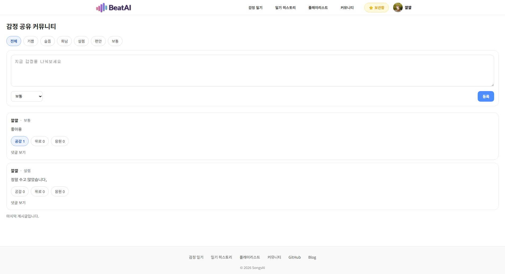
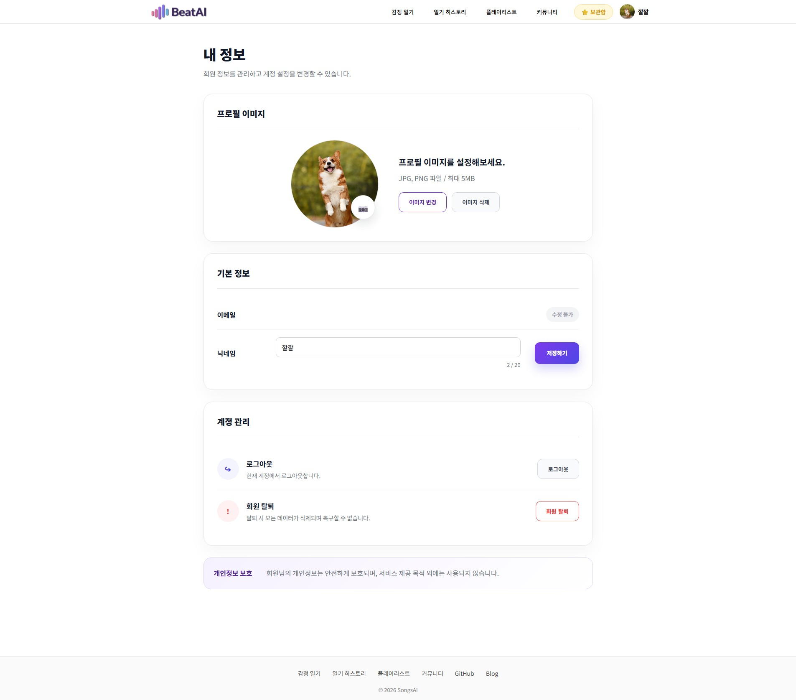

# 🎧 BeatAI

### 감정 기반 음악 추천 서비스

사용자가 작성한 일기를 바탕으로 감정을 분석하고,  
그 감정에 어울리는 음악을 추천해주는 **AI 기반 감정 음악 추천 웹 서비스**입니다.

 

## ✨ 프로젝트 소개

BeatAI는 단순한 음악 추천 서비스가 아니라,  
사용자의 감정 흐름을 이해하고 그에 맞는 음악을 제안하는 **개인화 감정 케어 서비스**를 목표로 했습니다.

일기 작성부터 감정 분석, 음악 추천, 감정 히스토리 확인, 커뮤니티 소통까지  
하나의 자연스러운 사용자 경험으로 연결되도록 설계했습니다.

---

## 🌐 Live Demo

- BeatAI 바로가기: [https://www.beatai.kro.kr/](https://www.beatai.kro.kr/)

---

## 🚀 주요 기능

- ✍️ **감정 일기 작성 및 분석**
  - 사용자가 작성한 일기를 기반으로 AI가 감정을 분석합니다.

- 🤖 **AI 기반 감정 추출**
  - FastAPI 기반 AI 서버를 통해 감정 점수와 주요 감정을 도출합니다.

- 🎵 **감정 맞춤 음악 추천**
  - 분석된 감정을 기반으로 추천 문구와 음악 검색 쿼리를 생성합니다.

- 📊 **감정 히스토리 조회**
  - 날짜별 일기 기록과 감정 흐름을 확인할 수 있습니다.

- 💾 **음악 보관함**
  - 추천받은 음악 중 마음에 드는 곡을 저장하고 다시 확인할 수 있습니다.

- 👥 **커뮤니티 기능**
  - 사용자들이 감정을 공유하고 공감·위로·응원의 반응을 주고받을 수 있습니다.

- 🖼️ **프로필 및 개인정보 관리**
  - 프로필 이미지 업로드(S3) 및 사용자 정보 수정 기능을 제공합니다.

---

## 📸 서비스 화면

### 🏠 메인 페이지

오늘의 감정 요약과 추천 음악을 한눈에 확인할 수 있는 메인 화면입니다.  

### ✍️ 감정 일기 작성

일기를 작성하면 AI가 감정을 분석하고 추천 음악 생성에 활용합니다.  

### 📊 일기 히스토리

작성한 일기를 날짜별로 조회하고 감정의 흐름을 확인할 수 있습니다.  

### 🎵 플레이리스트

감정 분석 결과를 바탕으로 추천된 음악을 확인할 수 있습니다.  

### 💾 보관함

사용자가 저장한 음악을 모아서 다시 감상할 수 있는 공간입니다.  

### 👥 커뮤니티

감정을 공유하고 다른 사용자와 소통할 수 있는 커뮤니티 공간입니다.  

### 🙋 내 정보

프로필 이미지 및 개인정보를 관리할 수 있는 사용자 설정 페이지입니다.  

---

## 🎯 프로젝트 목표

이 프로젝트는 다음과 같은 목표를 중심으로 진행했습니다.

- 일기 작성 → 감정 분석 → 음악 추천으로 이어지는 **사용자 흐름 설계**
- Spring Boot / React / FastAPI를 분리한 **서비스 구조 설계 경험**
- Docker 기반의 **배포 환경 구성**
- AWS EC2 / RDS / S3를 활용한 **실서비스형 인프라 경험**

---

## 🙋‍♂️ 담당 역할

본 프로젝트는 **개인 포트폴리오 프로젝트**로 진행하였으며,  
기획부터 프론트엔드, 백엔드, AI 서버 연동, 배포 환경 구성까지 전 과정을 직접 구현했습니다.

- 서비스 기획 및 화면 설계
- React + TypeScript 기반 프론트엔드 구현
- Spring Boot 기반 백엔드 API 설계 및 개발
- FastAPI 기반 AI 감정 분석 서버 연동
- Docker / Nginx / AWS 기반 배포 환경 구성
- S3 기반 이미지 저장 구조 설계 및 적용

---

## 🔄 서비스 동작 흐름

1. 사용자가 감정 일기를 작성합니다.
2. Backend가 일기 내용을 AI 서버(FastAPI)에 전달합니다.
3. AI 서버가 감정 점수와 주요 감정을 분석합니다.
4. Backend가 감정 분석 결과를 저장합니다.
5. 감정에 맞는 음악 검색 쿼리를 생성합니다.
6. YouTube API를 통해 추천 음악을 조회합니다.
7. 사용자에게 감정 기반 추천 결과를 제공합니다.

---

## 🏗️ 시스템 아키텍처

---

## 🛠️ 기술 스택

### Backend

- Spring Boot
- Spring Data JPA
- MySQL (RDS)

### Frontend

- React
- TypeScript
- Zustand

### AI

- FastAPI
- Ollama / OpenAI

### Infra

- Docker
- Docker Compose
- AWS EC2
- Nginx
- Redis

### Storage

- Amazon S3

---

## ⭐ 핵심 설계

### 1. 이미지 저장 구조 개선 (Local → S3)

초기에는 서버 로컬 경로에 이미지를 저장하는 방식을 사용했습니다.  
하지만 Docker 환경에서는 다음과 같은 문제가 발생했습니다.

- 컨테이너 재시작 시 데이터 유실
- Tomcat 임시 디렉토리 사용으로 파일 접근 문제 발생
- 서버와 파일 저장소가 강하게 결합되는 구조

이를 해결하기 위해 **Amazon S3 기반 이미지 저장 구조**로 전환했습니다.

`Client → Backend → S3 업로드 → URL 반환 → DB 저장`

#### ✅ 개선 결과

- 서버와 파일 저장소 분리
- Stateless 구조 확보
- 확장성 향상
- 안정적인 파일 접근 가능
- 향후 CloudFront 연동 가능 구조 마련

---

### 2. Reverse Proxy 기반 아키텍처

Nginx를 Reverse Proxy로 구성하여 요청을 다음과 같이 분리했습니다.

- 정적 파일 요청 → Frontend(React)
- API 요청(`/api`) → Backend(Spring Boot)

#### ✅ 적용 효과

- 서버 역할 분리
- HTTPS 처리 일원화
- 배포 구조 단순화
- 향후 서비스 확장에 유리한 구조 확보

---

## 🗄️ 데이터베이스 설계

### 👤 User

사용자 계정 정보를 저장하는 핵심 엔티티입니다.  
이메일, 닉네임, 비밀번호 등의 기본 정보와 카카오 로그인 같은 소셜 로그인 정보를 관리합니다.

**관계**

- User 1 : N Diary
- User 1 : N CommunityPost
- User 1 : N SavedVideo

---

### 📓 Diary

사용자가 작성한 감정 일기입니다.  
일기 내용(TEXT), AI 분석 결과(musicMessage, musicQuery), 생성일/수정일을 저장합니다.

**관계**

- Diary 1 : N EmotionLog
- Diary 1 : N RecommendedVideo
- Diary N : 1 User

---

### 😊 EmotionLog

일기 하나에 대한 감정 분석 결과를 저장합니다.  
하나의 일기에 여러 감정이 점수 형태로 저장됩니다.

예)

- 행복 0.6
- 슬픔 0.3

**관계**

- EmotionLog N : 1 Diary

---

### 🎭 EmotionType (Enum)

감정 종류를 정의하는 Enum입니다.

- HAPPY
- SAD
- ANGRY
- CALM
- EXCITED
- NEUTRAL

---

### 🎵 RecommendedVideo

AI 분석 이후 추천된 음악 정보를 저장합니다.

- YouTube videoId
- 제목
- 채널명
- 썸네일
- 정렬 순서

**관계**

- RecommendedVideo N : 1 Diary

---

### 💾 SavedVideo

사용자가 보관한 음악 정보를 저장합니다.

**관계**

- SavedVideo N : 1 User

---

### 🧾 CommunityPost

커뮤니티 게시글 정보를 저장합니다.  
게시글 내용과 감정 태그(위로, 공감 등)를 포함합니다.

**관계**

- CommunityPost N : 1 User
- CommunityPost 1 : N CommunityComment
- CommunityPost 1 : N PostReaction

---

### 💬 CommunityComment

커뮤니티 게시글에 달린 댓글입니다.

**관계**

- CommunityComment N : 1 CommunityPost
- CommunityComment N : 1 User

---

### 🎯 CommunityEmotion

커뮤니티 감정 카테고리를 정의합니다.

예)

- 위로
- 공감
- 응원

---

### ❤️ PostReaction

게시글에 대한 사용자 반응 정보를 저장합니다.

예)

- 공감
- 위로
- 응원

**관계**

- PostReaction N : 1 CommunityPost
- PostReaction N : 1 User

---

### 🎯 ReactionType (Enum)

반응 종류를 정의하는 Enum입니다.

- EMPATHY
- CHEER
- COMFORT

---

### 🎨 DiarySticker

일기에 부착하는 스티커 기능을 위한 엔티티입니다.  
감정 표현을 보다 직관적으로 보조하기 위해 설계했습니다.

**관계**

- DiarySticker N : 1 Diary

---

### 🔐 SignupVerification

회원가입 시 이메일 인증을 처리하기 위한 엔티티입니다.

- 이메일 인증 코드
- 인증 여부

---

## 🧠 트러블슈팅

### 1. Docker 환경에서 이미지 업로드 실패

**문제**  
이미지 업로드 시 파일 저장이 정상적으로 이루어지지 않는 문제가 발생했습니다.

**원인**

- 상대 경로(`./uploads`) 사용
- Tomcat 임시 디렉토리 기준으로 파일 저장

**해결**

- 절대 경로(`/app/uploads`)로 변경
- Docker volume 연결
- 이후 Amazon S3 구조로 전환하여 근본적으로 해결

---

### 2. HTTPS → HTTP 리다이렉트 문제

**문제**  
카카오 로그인 이후 HTTPS가 유지되지 않고 HTTP로 전환되는 문제가 발생했습니다.

**원인**

- redirect URI가 IP 기반으로 설정됨
- 프록시 환경에서 HTTPS 정보가 올바르게 전달되지 않음

**해결**

- 도메인 기반 redirect URI 사용
- Nginx 프록시 설정 추가

---

### 3. S3 이미지 접근 불가 (AccessDenied)

**문제**  
업로드된 이미지 URL 접근 시 AccessDenied 오류가 발생했습니다.

**원인**

- S3 퍼블릭 접근 차단 설정
- 버킷 정책 미설정

**해결**

- 퍼블릭 접근 허용
- 버킷 정책 추가

---

## 📊 성과 및 결과

- 감정 분석 기반 음악 추천 기능 구현
- Docker 기반 배포 환경 구축 및 EC2 배포 완료
- S3 적용을 통한 이미지 저장 안정성 확보
- 커뮤니티 기능을 포함한 풀스택 서비스 완성

### 기술적 성과

- Frontend / Backend / AI Server 분리 구조 설계
- Zustand 기반 로그인 상태 관리 구현
- WebSocket 기반 실시간 커뮤니티 구조 설계 및 구현

---

## 📌 향후 개선 방향

- CloudFront CDN 적용
- 이미지 압축 및 썸네일 처리
- AI 추천 정확도 개선
- 로컬 AI / OpenAI API 실행 환경 분리
- GitHub Actions + Jenkins 기반 CI/CD 자동화
- 커뮤니티 실시간 기능 고도화

---

## 🔗 느낀 점

이번 프로젝트를 통해 단순한 CRUD 구현을 넘어,  
**AI 서비스 연동**, **인프라 구성**, **배포 환경 설계**, **실서비스 구조 고민**까지 경험할 수 있었습니다.

특히 감정 분석과 음악 추천이라는 주제를 사용자 경험 관점에서 연결해보며,  
기능 구현뿐 아니라 **서비스 흐름을 설계하는 시각**도 함께 키울 수 있었습니다.
